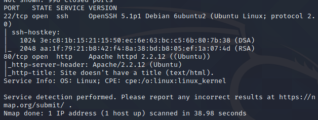
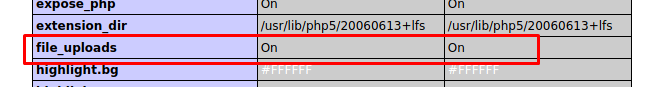
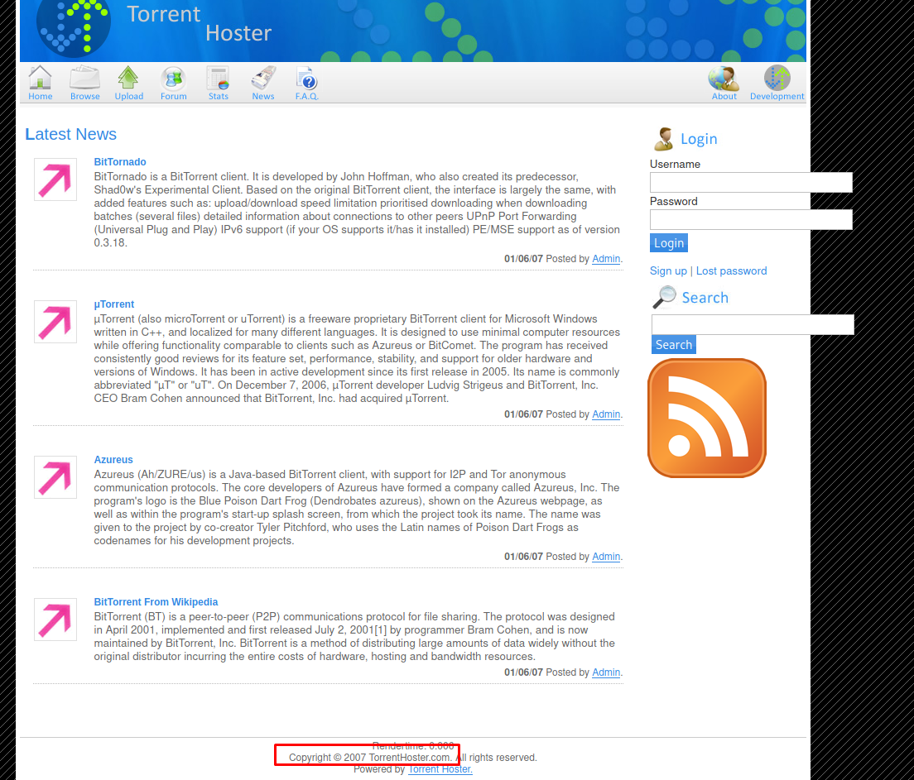
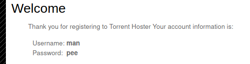
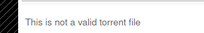
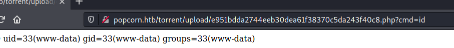
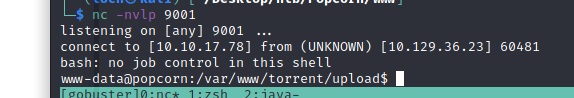
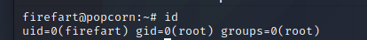

ip: 10.129.36.23

# initial enum:

open ports: 22, 80

running feroxbuster gave me an endpoint: `/test`
it shows we can upload files

found endpoint: `/torrent`

copyright 2007, probably vulnerable to something
also, new username: **admin

there's also an upload endpoint but we need to log in to use it, so let's register an account

we can upload a torrent now. lets see if we can upload a shell

nope. 
lets try uploading a torrent
i used the kali linux download torrent, and it uploaded successfully

# User flag

i continued looking around and i saw that i could upload screenshots, so i tried uploading a php file but specified it as a jpg in the request and it worked lol
so i now have a shell as www-data

lets see if i can get a revshell

found creds in the /readme/readme.html file
also found an md5 hash for the admin account in the `torrent/database/` db file
**admin:1844156d4166d94387f1a4ad031ca5fa**
**admin:admin12** 

in the **/etc/passwd** file we get another user:
`george:x:1000:1000:George Papagiannopoulos,,,:/home/george:/bin/bash`
I also found out that the **www-data** user has a shell, for some reason.

sniffing around i find that i can read the user flag within George's directory so thats how i got the user flag. 

# Root flag

after a quick 5 minute break to clear my mind i continued looking around the box, running linpeas, which didn't result in anything sadly. however, it gave me a small idea:
if the webserver running is from 2007, what's stopping this box to have other outdated pieces of software?

so i looked around some more and saw that the kernel version (`Linux popcorn 2.6.31-14-generic-pae #48-Ubuntu SMP Fri Oct 16 15:22:42 UTC 2009 i686 GNU/Linux`) is outdated and is vulnerable to the [dirty cow](https://www.exploit-db.com/exploits/40839) exploit
so i compiled it on the box, ran it and got a root shell via ssh:

