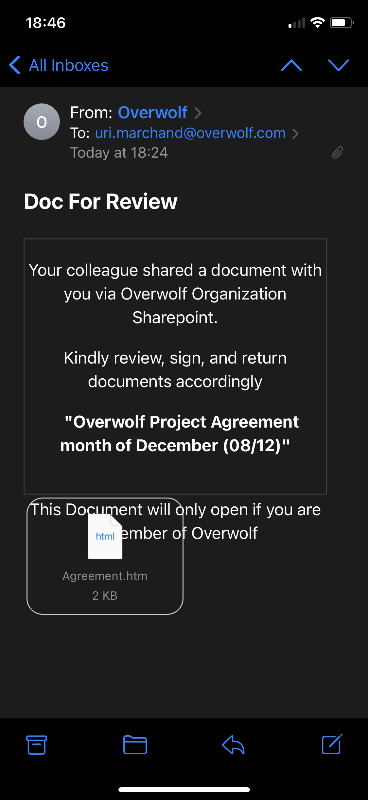
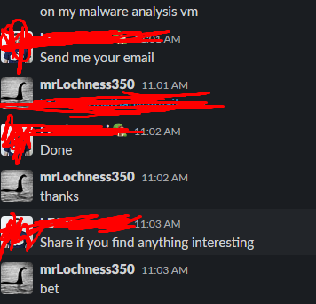
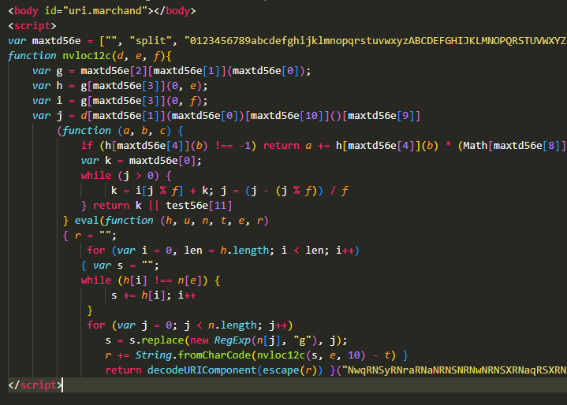
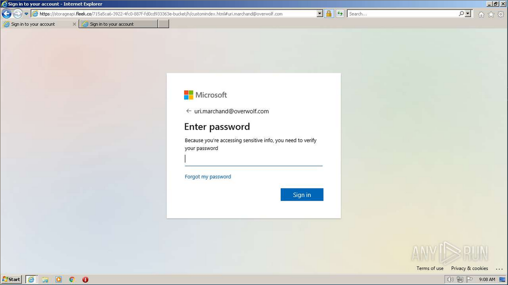
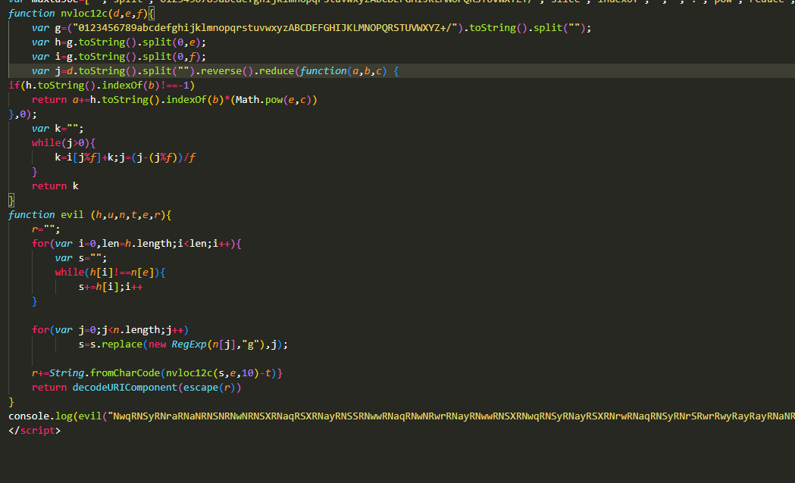
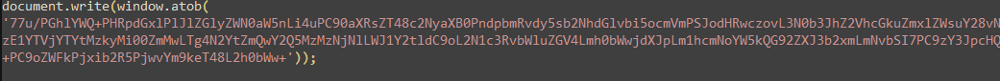
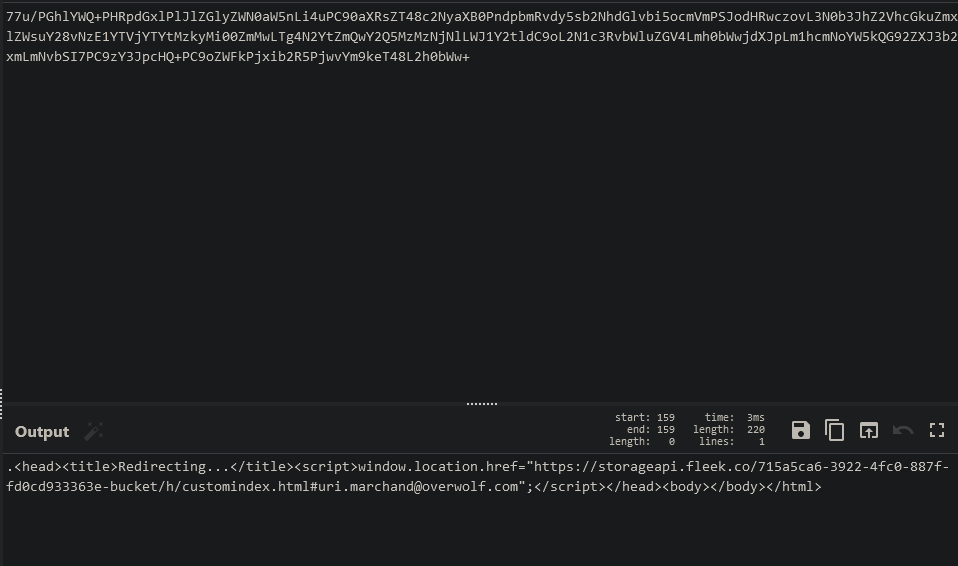

# A short story about an unsuccessful Phishing attempt

Sha256 of sample: 6808B72F5B9A6F210A9A811DEFFB93C81E7810C9560C206A6EAB8303B6B316D9
Virustotal: <https://www.virustotal.com/gui/file/6808b72f5b9a6f210a9a811deffb93c81e7810c9560c206a6eab8303b6b316d9?nocache=1>

## The Beginning

This story starts one day a few months ago, when we received an alert that our CEO got a very suspicious Email claiming that he needs to log into his Microsoft OneDrive account to sign some stuff

Once I read the messages about it, I immediately asked for the file:

## The Analysis

Immediately upon opening the file, I saw something that triggered some red flags for me:

* Why is there a massive string that doesn't make any sense in any way?
* What's with all these weird functions?
* Why is eval being called here?

So from here I started manually deobfuscating it, while putting it through Any.Run, to see what it does:

Any.Run showed that it opens up a tab resembling the Microsoft login page with the email address of the CEO. From here I already had a hunch about what I'll find when manually deobfuscating the code, but I continued anyway

I immediately changed the `eval` to a `console.log` as a safety precaution, and also started deobfuscating the code itself down to some sort of readable code:

The code appears to convert letters within the very long string passed to the `evil` argument into other letters that end up returning the decoded string

From here I let it run and got the following code snippet:

Which when decoded returns the following code:

In the decoded code I noticed it redirects to a URL: `https[:]//storageapi[.]fleek[.]co/715a5ca6-3922-4fc0-887f-fd0cd933363e-bucket/h/customindex.html#uri.marchand@overwolf.com`

That has that same Window open. However, as of the writing of this blog post, the domain consistently redirects to an access denied page, leading me to think that the bad actor decided to close down their attempt to phish the CEO

## The End

Nothing really came out from digging into the website so I decided to let it go this time. Thanks for reading!